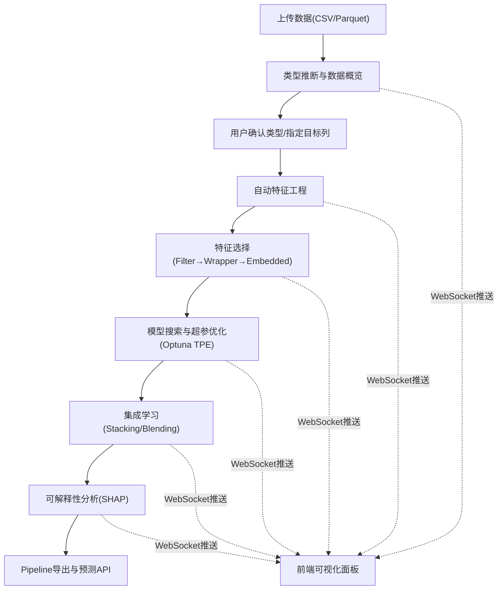

## 1. 产品概述

AutoFeature 是一个表格数据的自动特征工程与模型自动选择平台。用户上传 CSV/Parquet 数据集后，系统自动完成从数据探索、特征构造、模型训练到最优 Pipeline 输出的全流程，并提供可视化面板查看中间过程和最终结果。

- 面向数据科学家和机器学习工程师，降低特征工程和模型调参的门槛
- 核心价值：一键完成 AutoML 全流程，透明可解释，Pipeline 可复用

## 2. 核心功能

### 2.1 用户角色

| 角色 | 注册方式 | 核心权限 |
|------|----------|----------|
| 普通用户 | 无需注册 | 上传数据、查看分析结果、下载 Pipeline |
| 高级用户 | 无需注册 | 同上，可自定义特征工程参数 |

### 2.2 功能模块

1. **数据导入页面**: 文件上传、类型推断编辑、目标列选择、数据概览
2. **特征工程页面**: 自动特征变换配置、特征维度变化展示、变换贡献统计
3. **特征选择页面**: 三阶段筛选过程展示、特征重要性柱状图
4. **模型搜索页面**: 超参搜索实时进度、模型对比表格、最优模型高亮
5. **集成学习页面**: Stacking/Blending 集成结果、与单模型对比
6. **可解释性页面**: SHAP 全局/局部解释、蜂群图、力图
7. **Pipeline 导出页面**: Pipeline 下载、预测 API 调用

### 2.3 页面详情

| 页面名称 | 模块名称 | 功能描述 |
|----------|----------|----------|
| 数据导入 | 文件上传区 | 支持 CSV/Parquet，上限 200MB，拖拽上传 |
| 数据导入 | 类型推断表格 | 自动推断列类型（数值/类别/时间/文本），可编辑修正 |
| 数据导入 | 目标列选择 | 自动检测含 target/label/y 的列，否则手动选择 |
| 数据导入 | 数据概览面板 | 总行数/列数、各类型列数、缺失值 Top10、数值分布直方图、类别频率 Top5 |
| 特征工程 | 变换策略配置 | 数值/类别/时间/文本列的变换参数配置 |
| 特征工程 | 维度变化展示 | 原始 N 列到变换后 M 列的对比，各变换类别贡献特征数 |
| 特征选择 | Filter 阶段 | 零方差和零互信息列淘汰展示 |
| 特征选择 | Wrapper 阶段 | RFE 递归消除过程，剩余特征数变化 |
| 特征选择 | Embedded 阶段 | L1/Lasso 筛选结果 |
| 特征选择 | 重要性柱状图 | Top30 特征重要性可视化 |
| 模型搜索 | 搜索进度 | 实时最优分数、Trial 进度条、WebSocket 推送 |
| 模型搜索 | 模型对比表格 | 各模型最优超参和 CV 分数，高亮最优 |
| 集成学习 | Stacking 结果 | 前3模型 OOF 预测元特征 + 元学习器 |
| 集成学习 | Blending 结果 | 20% holdout 验证集方案 |
| 集成学习 | 对比展示 | 集成 vs 单模型分数对比 |
| 可解释性 | 全局解释 | SHAP 均值柱状图 Top20、蜂群图 |
| 可解释性 | 局部解释 | 样本索引输入、SHAP 力图 |
| Pipeline 导出 | Pipeline 下载 | joblib 序列化文件下载 |
| Pipeline 导出 | 预测 API | 上传新 CSV → 返回预测值 + SHAP Top5 |

## 3. 核心流程

用户上传数据 → 系统推断列类型 → 用户确认/修正类型并指定目标列 → 自动特征工程 → 特征选择（Filter→Wrapper→Embedded）→ 模型搜索与超参优化 → 集成学习 → 可解释性分析 → Pipeline 导出与预测

## 4. 用户界面设计

### 4.1 设计风格

- 主色调: 深色主题，深蓝灰(#0f172a)背景，翡翠绿(#10b981)作为主强调色，琥珀色(#f59e0b)作为辅助强调色
- 按钮风格: 圆角按钮，hover 时发光效果，主按钮翡翠绿实心，次要按钮半透明边框
- 字体: JetBrains Mono 作为数据/代码字体，Noto Sans SC 作为界面字体
- 布局风格: 左侧导航栏 + 右侧内容区，步骤流程条指引操作，卡片式信息展示
- 图标: Lucide React 图标库
- 数据可视化: ECharts 图表库

### 4.2 页面设计概览

| 页面名称 | 模块名称 | UI元素 |
|----------|----------|--------|
| 数据导入 | 文件上传区 | 虚线边框拖拽区，上传进度条，文件大小/格式校验提示 |
| 数据导入 | 类型推断表格 | 可编辑表格，下拉选择列类型，颜色编码区分类型 |
| 数据导入 | 数据概览 | 统计卡片(行数/列数/缺失率)，直方图，条形图 |
| 特征工程 | 变换配置 | 分区卡片(数值/类别/时间/文本)，开关+参数滑块 |
| 特征工程 | 维度变化 | 对比条形图(原始vs变换后)，环形图(各变换贡献) |
| 特征选择 | 三阶段进度 | 步骤条+每阶段结果卡片，淘汰特征标签列表 |
| 特征选择 | 重要性图 | 横向柱状图Top30，渐变色柱体 |
| 模型搜索 | 搜索进度 | 实时进度条，分数折线图，Trial计数器 |
| 模型搜索 | 模型对比 | 排序表格，最优行高亮发光，分数条形对比 |
| 集成学习 | 对比展示 | 双柱对比图(集成vs单模型)，提升百分比标注 |
| 可解释性 | 全局解释 | SHAP柱状图，蜂群图(渐变散点) |
| 可解释性 | 局部解释 | 输入框+力图(红蓝双向条形) |
| Pipeline导出 | 下载/API | 下载按钮(带动画)，API调用面板(拖拽+JSON返回) |

### 4.3 响应式设计

- 桌面优先设计，最小支持1280px宽度
- 图表区域自适应容器宽度
- 移动端折叠侧边栏，表格横向滚动

### 4.4 3D场景

不适用
