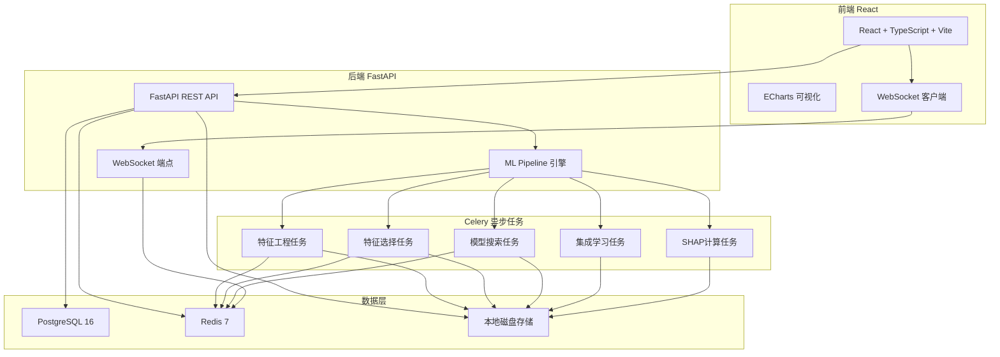
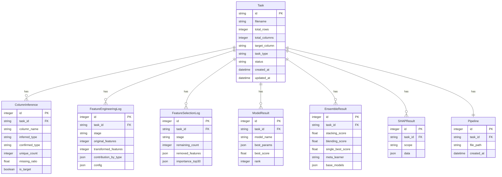

## 1. 架构设计



## 2. 技术说明

- 前端: React@18 + TypeScript + Vite + TailwindCSS + Zustand + ECharts + React Router
- 初始化工具: Vite
- 后端: Python FastAPI + Celery + Redis
- 数据库: PostgreSQL 16 (元信息存储)
- 缓存/队列: Redis 7 (Celery Broker + 结果后端 + WebSocket 消息)
- 文件存储: 本地磁盘 (上传数据集、模型文件)
- ML 库: scikit-learn, xgboost, lightgbm, catboost, shap, optuna, pandas, numpy
- 容器: Docker Compose (4 服务)

## 3. 路由定义

| 路由 | 用途 |
|------|------|
| `/` | 首页/上传数据 |
| `/overview/:taskId` | 数据概览与类型推断 |
| `/feature-engineering/:taskId` | 自动特征工程 |
| `/feature-selection/:taskId` | 特征选择 |
| `/model-search/:taskId` | 模型搜索与超参优化 |
| `/ensemble/:taskId` | 集成学习 |
| `/explainability/:taskId` | 可解释性分析 |
| `/pipeline/:taskId` | Pipeline 导出与预测 API |

## 4. API 定义

### 4.1 数据上传与推断

```typescript
interface UploadResponse {
  task_id: string
  filename: string
  rows: number
  columns: number
}

interface ColumnInference {
  name: string
  inferred_type: "numeric" | "categorical" | "datetime" | "text"
  unique_count: number
  missing_ratio: number
  sample_values: string[]
}

interface DataOverview {
  total_rows: number
  total_columns: number
  type_counts: Record<string, number>
  missing_top10: Array<{ column: string; ratio: number }>
  numeric_histograms: Array<{ column: string; bins: number[]; counts: number[] }>
  categorical_top5: Array<{ column: string; values: Array<{ value: string; count: number }> }>
}

// POST /api/upload - 上传数据文件
// GET  /api/tasks/{task_id}/inference - 获取类型推断结果
// PUT  /api/tasks/{task_id}/inference - 修正列类型
// POST /api/tasks/{task_id}/target - 设置目标列
// GET  /api/tasks/{task_id}/overview - 获取数据概览
```

### 4.2 特征工程

```typescript
interface FeatureEngineeringConfig {
  numeric: {
    polynomial: boolean
    polynomial_top_k: number
    binning: boolean
    binning_bins: number[]
    log_transform: boolean
    standardize: boolean
  }
  categorical: {
    onehot_threshold: number
    target_encoding: boolean
    frequency_encoding: boolean
  }
  datetime: {
    extract_components: boolean
    days_diff: boolean
  }
  text: {
    tfidf: boolean
    tfidf_max_features: number
  }
  cross: {
    ratio_features: boolean
    ratio_top_k: number
  }
}

interface FeatureEngineeringResult {
  original_features: number
  transformed_features: number
  contribution_by_type: Record<string, number>
  feature_names: string[]
}

// POST /api/tasks/{task_id}/feature-engineering - 启动特征工程
// GET  /api/tasks/{task_id}/feature-engineering/result - 获取结果
```

### 4.3 特征选择

```typescript
interface FeatureSelectionResult {
  filter_remaining: number
  filter_removed: string[]
  wrapper_remaining: number
  wrapper_removed: string[]
  embedded_remaining: number
  embedded_removed: string[]
  importance_top30: Array<{ feature: string; importance: number }>
  selected_features: string[]
}

// POST /api/tasks/{task_id}/feature-selection - 启动特征选择
// GET  /api/tasks/{task_id}/feature-selection/result - 获取结果
```

### 4.4 模型搜索

```typescript
interface ModelSearchProgress {
  model_name: string
  trial_number: number
  max_trials: number
  best_score: number
  status: "running" | "completed"
}

interface ModelSearchResult {
  models: Array<{
    name: string
    best_params: Record<string, any>
    best_score: number
    rank: number
  }>
  best_model: string
  best_score: number
}

// POST /api/tasks/{task_id}/model-search - 启动模型搜索
// GET  /api/tasks/{task_id}/model-search/result - 获取结果
// GET  /api/tasks/{task_id}/model-search/progress - 获取搜索进度
```

### 4.5 集成学习

```typescript
interface EnsembleResult {
  stacking_score: number
  blending_score: number
  single_best_score: number
  stacking_improvement: number
  blending_improvement: number
  base_models: string[]
  meta_learner: string
}

// POST /api/tasks/{task_id}/ensemble - 启动集成学习
// GET  /api/tasks/{task_id}/ensemble/result - 获取结果
```

### 4.6 可解释性

```typescript
interface SHAPGlobalResult {
  feature_importance_top20: Array<{ feature: string; mean_shap: number }>
  beeswarm_data: Array<{ feature: string; values: number[]; shap_values: number[] }>
}

interface SHAPLocalResult {
  sample_index: number
  base_value: number
  features: Array<{ feature: string; value: number; shap_value: number }>
}

// POST /api/tasks/{task_id}/explainability - 启动SHAP计算
// GET  /api/tasks/{task_id}/explainability/global - 全局解释
// GET  /api/tasks/{task_id}/explainability/local?sample_index=0 - 局部解释
```

### 4.7 Pipeline 与预测

```typescript
interface PredictRequest {
  task_id: string
}

interface PredictResponse {
  predictions: number[]
  shap_top5_per_row: Array<Array<{ feature: string; contribution: number }>>
}

// GET  /api/tasks/{task_id}/pipeline/download - 下载Pipeline
// POST /api/tasks/{task_id}/predict - 使用Pipeline预测
```

### 4.8 WebSocket

```typescript
// WS /ws/tasks/{task_id}
interface WSMessage {
  stage: "feature_engineering" | "feature_selection" | "model_search" | "ensemble" | "explainability"
  status: "started" | "progress" | "completed" | "failed"
  progress?: number
  detail?: any
}
```

## 5. 服务器架构图

```mermaid
flowchart LR
    subgraph FastAPI["FastAPI 应用"]
        Router["API Router"]
        WSHandler["WebSocket Handler"]
    end
    
    subgraph Services["服务层"]
        UploadService["上传服务"]
        InferenceService["类型推断服务"]
        FeatureEngService["特征工程服务"]
        FeatureSelService["特征选择服务"]
        ModelSearchService["模型搜索服务"]
        EnsembleService["集成学习服务"]
        ExplainService["可解释性服务"]
        PipelineService["Pipeline 服务"]
    end
    
    subgraph CeleryApp["Celery Worker"]
        TaskQueue["任务队列"]
        TaskRunner["任务执行器"]
    end
    
    subgraph DataLayer["数据层"]
        PG["PostgreSQL"]
        RedisStore["Redis"]
        FileStore["文件存储"]
    end
    
    Router --> UploadService
    Router --> InferenceService
    Router --> FeatureEngService
    Router --> FeatureSelService
    Router --> ModelSearchService
    Router --> EnsembleService
    Router --> ExplainService
    Router --> PipelineService
    
    FeatureEngService --> TaskQueue
    FeatureSelService --> TaskQueue
    ModelSearchService --> TaskQueue
    EnsembleService --> TaskQueue
    ExplainService --> TaskQueue
    
    TaskQueue --> TaskRunner
    
    WSHandler --> RedisStore
    
    Services --> PG
    Services --> FileStore
    TaskRunner --> PG
    TaskRunner --> FileStore
    TaskRunner --> RedisStore
```



## 6. 数据模型

### 6.1 数据模型定义



### 6.2 数据定义语言

```sql
CREATE TABLE task (
    id VARCHAR(36) PRIMARY KEY,
    filename VARCHAR(255) NOT NULL,
    total_rows INTEGER NOT NULL,
    total_columns INTEGER NOT NULL,
    target_column VARCHAR(255),
    task_type VARCHAR(20),
    status VARCHAR(20) DEFAULT 'uploaded',
    created_at TIMESTAMP DEFAULT CURRENT_TIMESTAMP,
    updated_at TIMESTAMP DEFAULT CURRENT_TIMESTAMP
);

CREATE TABLE column_inference (
    id SERIAL PRIMARY KEY,
    task_id VARCHAR(36) REFERENCES task(id) ON DELETE CASCADE,
    column_name VARCHAR(255) NOT NULL,
    inferred_type VARCHAR(20) NOT NULL,
    confirmed_type VARCHAR(20) NOT NULL,
    unique_count INTEGER NOT NULL,
    missing_ratio FLOAT NOT NULL,
    is_target BOOLEAN DEFAULT FALSE
);

CREATE TABLE feature_engineering_log (
    id SERIAL PRIMARY KEY,
    task_id VARCHAR(36) REFERENCES task(id) ON DELETE CASCADE,
    stage VARCHAR(50) NOT NULL,
    original_features INTEGER NOT NULL,
    transformed_features INTEGER NOT NULL,
    contribution_by_type JSONB,
    config JSONB
);

CREATE TABLE feature_selection_log (
    id SERIAL PRIMARY KEY,
    task_id VARCHAR(36) REFERENCES task(id) ON DELETE CASCADE,
    stage VARCHAR(50) NOT NULL,
    remaining_count INTEGER NOT NULL,
    removed_features JSONB,
    importance_top30 JSONB
);

CREATE TABLE model_result (
    id SERIAL PRIMARY KEY,
    task_id VARCHAR(36) REFERENCES task(id) ON DELETE CASCADE,
    model_name VARCHAR(50) NOT NULL,
    best_params JSONB,
    best_score FLOAT NOT NULL,
    rank INTEGER NOT NULL
);

CREATE TABLE ensemble_result (
    id SERIAL PRIMARY KEY,
    task_id VARCHAR(36) REFERENCES task(id) ON DELETE CASCADE,
    stacking_score FLOAT,
    blending_score FLOAT,
    single_best_score FLOAT NOT NULL,
    meta_learner VARCHAR(50),
    base_models JSONB
);

CREATE TABLE shap_result (
    id SERIAL PRIMARY KEY,
    task_id VARCHAR(36) REFERENCES task(id) ON DELETE CASCADE,
    scope VARCHAR(20) NOT NULL,
    data JSONB NOT NULL
);

CREATE TABLE pipeline (
    id SERIAL PRIMARY KEY,
    task_id VARCHAR(36) REFERENCES task(id) ON DELETE CASCADE,
    file_path VARCHAR(512) NOT NULL,
    created_at TIMESTAMP DEFAULT CURRENT_TIMESTAMP
);

CREATE INDEX idx_column_inference_task ON column_inference(task_id);
CREATE INDEX idx_feature_eng_log_task ON feature_engineering_log(task_id);
CREATE INDEX idx_feature_sel_log_task ON feature_selection_log(task_id);
CREATE INDEX idx_model_result_task ON model_result(task_id);
CREATE INDEX idx_ensemble_result_task ON ensemble_result(task_id);
CREATE INDEX idx_shap_result_task ON shap_result(task_id);
CREATE INDEX idx_pipeline_task ON pipeline(task_id);
```

## 7. Docker Compose 服务编排

| 服务 | 镜像 | 端口 | 说明 |
|------|------|------|------|
| backend | python:3.11-slim | 8000 | FastAPI + Celery Worker |
| frontend | nginx:alpine | 80 | React 编译产物 |
| redis | redis:7-alpine | 6379 | 消息队列 + 缓存 |
| db | postgres:16-alpine | 5432 | 元信息数据库 |
